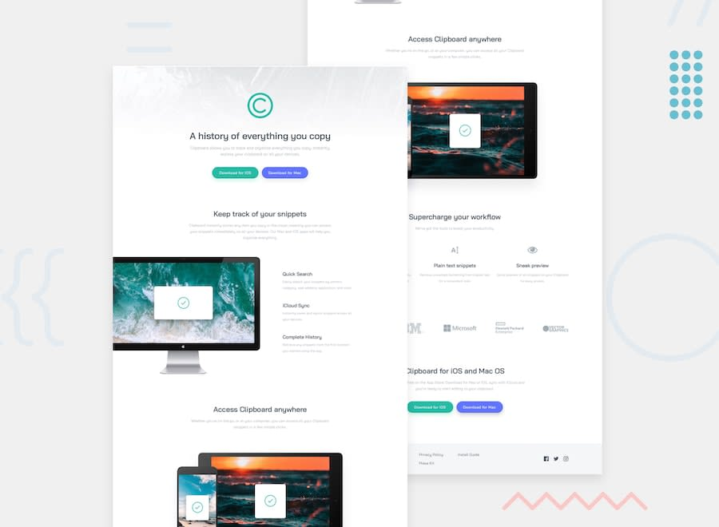
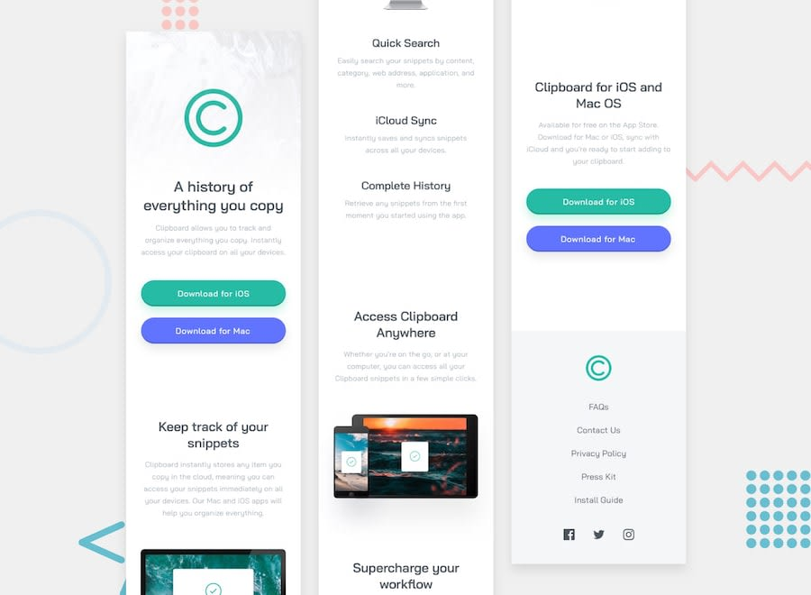
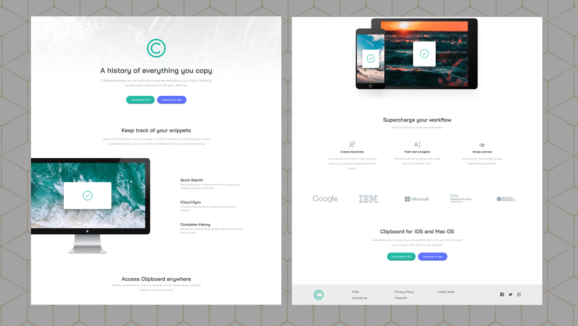
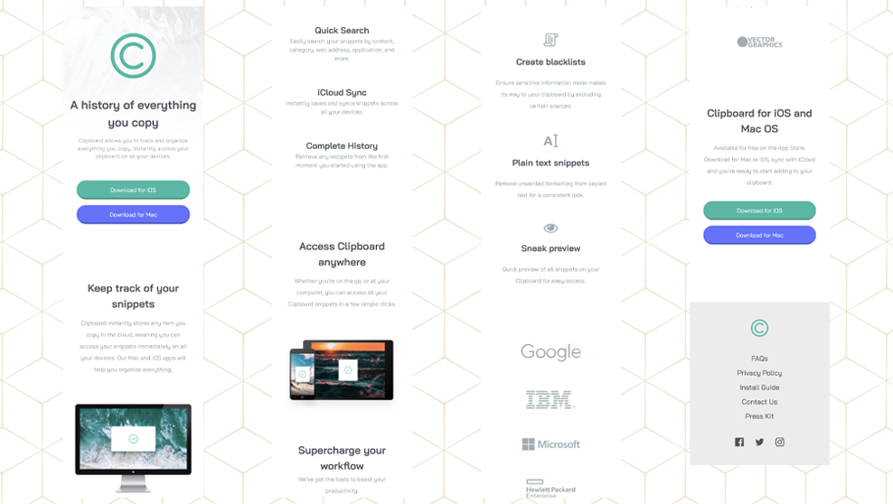
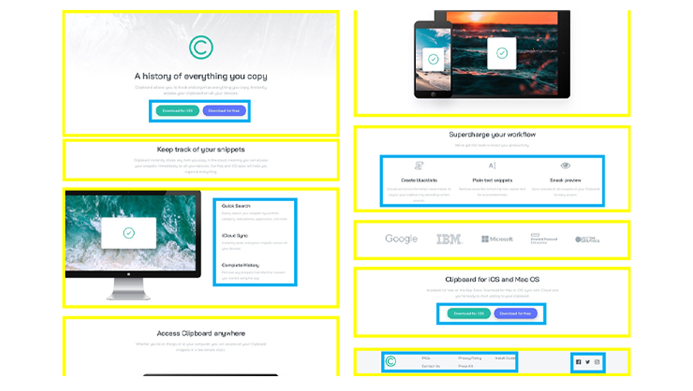

### Links

- Solution URL: (https://www.frontendmentor.io/solutions/clipboard-landing-page-with-css-grid-and-flexbox-vebzO1g9zi)
- Live Site URL: (https://smgy94.github.io/front-end-mentor-projects/clipboard-landing-page-master/)


# Frontend Mentor - Clipboard landing page solution

This is a solution to the [Clipboard landing page challenge on Frontend Mentor](https://www.frontendmentor.io/challenges/clipboard-landing-page-5cc9bccd6c4c91111378ecb9). Frontend Mentor challenges help you improve your coding skills by building realistic projects.

## Table of contents

- [Links](#links)
- [Original Design](#original-design)
- [Screenshots Of My Design](#screenshots)
- [My process](#my-process)
- [Built with](#built-with)
- [What I learned](#what-i-learned)
- [Useful resources](#useful-resources)


### Original Design





### Screenshots of my design





## My process

I opened the design in Adobe Photoshop and broke it into several different sections using yellow & blue rectangles. I looked at each section and then decided to use either CSS Grid / Flexbox to achieve the desired layout.

I began working from the top down. Once I completed a section on desktop I would then ensure that it was also working on mobile using a media query.



### Built with

- Semantic HTML5 markup
- CSS custom properties
- Flexbox
- CSS Grid

### What I learned

1.  I had issue with changing the colour of the social media icons (.SVG's) on :hover

The solution was to specify 'svg path'

```
.svg path:hover {
  fill: var(--Strong-Cyan);
}
```

2.  I had issues getting this design to scale on tablet sized devices.

My solution was to add a media query for tablets:

```
@media only screen and (min-width: 481px) and (max-width: 820px) {

}
```

3.  I wasn't sure if my HTML was completely semantically correct.

### Useful resources

- [A Complete Guide to Grid ](https://css-tricks.com/snippets/css/complete-guide-grid/) - This helped me for laying out all of page elements. I really liked this guide and will use it going forward.

## Author

- Frontend Mentor - [@Smgy94](https://www.frontendmentor.io/profile/Smgy94)
- LinkedIn - (https://www.linkedin.com/in/shanemcgeown/)
- Twitter - (https://twitter.com/ShaneMcGeown94)
